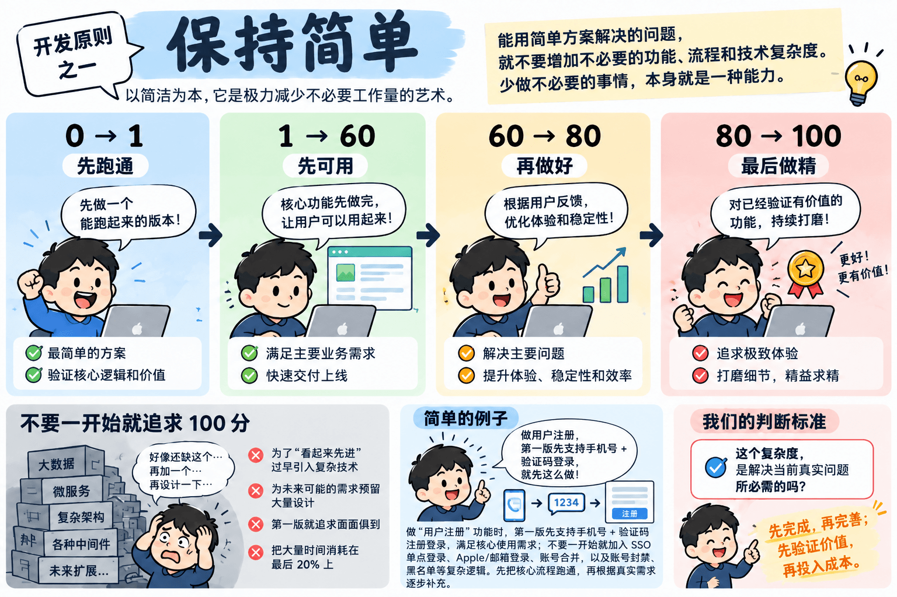

# 前言

制定这些原则，希望团队拥有一套共同的<mark style="background:#FFE08A;padding:0 3px;border-radius:3px">思考方式</mark>和<mark style="background:#FFE08A;padding:0 3px;border-radius:3px">做事标准</mark>，非为了增加规则和约束。

研发工作充满变化，我们很难为每件事情都制定详细规则。相比告诉大家“具体怎么做”，希望团队明确我们做事情的<mark style="background:#FFE08A;padding:0 3px;border-radius:3px">基本原则</mark>。

当遇到问题、分歧和选择时，希望每个人都能基于这些原则<mark style="background:#FFD8A8;padding:0 3px;border-radius:3px">独立思考</mark>、<mark style="background:#FFD8A8;padding:0 3px;border-radius:3px">自主判断</mark>、<mark style="background:#FFD8A8;padding:0 3px;border-radius:3px">高效协作</mark>。

用共同的原则，<mark style="background:#B2F2BB;padding:0 3px;border-radius:3px">减少管理和指令</mark>，释放团队的<mark style="background:#B2F2BB;padding:0 3px;border-radius:3px">自主性</mark>与<mark style="background:#B2F2BB;padding:0 3px;border-radius:3px">创造力</mark>。

# 保持简单 Keep It Simple

**原则：**
以<mark style="background:#FFE08A;padding:0 3px;border-radius:3px">简洁</mark>为本，它是极力减少<mark style="background:#FFE08A;padding:0 3px;border-radius:3px">不必要工作量</mark>的艺术。

我们做事情遵循：<mark style="background:#A5D8FF;padding:0 3px;border-radius:3px">**0 → 1**</mark>，<mark style="background:#A5D8FF;padding:0 3px;border-radius:3px">**1 → 60**</mark>，<mark style="background:#A5D8FF;padding:0 3px;border-radius:3px">**60 → 80**</mark>，<mark style="background:#A5D8FF;padding:0 3px;border-radius:3px">**80 → 100**</mark>。

**说明：**
不要一开始就追求完整和完美。先解决“<mark style="background:#A5D8FF;padding:0 3px;border-radius:3px">有没有</mark>”，再解决“<mark style="background:#A5D8FF;padding:0 3px;border-radius:3px">能不能用</mark>”，然后解决“<mark style="background:#A5D8FF;padding:0 3px;border-radius:3px">好不好用</mark>”，最后才追求<mark style="background:#A5D8FF;padding:0 3px;border-radius:3px">极致</mark>。

* **0 → 1：<mark style="background:#A5D8FF;padding:0 3px;border-radius:3px">先跑通</mark>。** 用最简单的方案验证核心逻辑和价值。
* **1 → 60：<mark style="background:#A5D8FF;padding:0 3px;border-radius:3px">先可用</mark>。** 快速完成核心功能，满足主要业务需求。
* **60 → 80：<mark style="background:#A5D8FF;padding:0 3px;border-radius:3px">再做好</mark>。** 根据真实使用和反馈，解决主要问题，提升体验、稳定性和效率。
* **80 → 100：<mark style="background:#A5D8FF;padding:0 3px;border-radius:3px">最后做精</mark>。** 对已经被验证有长期价值的事情，再投入资源持续优化。

**我们不提倡：**
一个功能还没有经过验证，就提前设计大量<mark style="background:#FFC9C9;padding:0 3px;border-radius:3px">扩展能力</mark>；为了未来“可能出现”的需求增加<mark style="background:#FFC9C9;padding:0 3px;border-radius:3px">复杂架构</mark>；第一版就追求<mark style="background:#FFC9C9;padding:0 3px;border-radius:3px">面面俱到</mark>，把大量时间消耗在<mark style="background:#FFC9C9;padding:0 3px;border-radius:3px">最后 20%</mark> 上。

**例子：用户模块开发**
- 1.0版本：支持<mark style="background:#B2F2BB;padding:0 3px;border-radius:3px">手机号 + 验证码</mark>注册登录，满足核心使用需求；
- <mark style="background:#FFC9C9;padding:0 3px;border-radius:3px">拒绝</mark>就加入 <mark style="background:#FFC9C9;padding:0 3px;border-radius:3px">SSO</mark>、<mark style="background:#FFC9C9;padding:0 3px;border-radius:3px">Apple/邮箱登录</mark>、<mark style="background:#FFC9C9;padding:0 3px;border-radius:3px">账号合并</mark>，以及<mark style="background:#FFC9C9;padding:0 3px;border-radius:3px">账号封禁</mark>、<mark style="background:#FFC9C9;padding:0 3px;border-radius:3px">黑名单</mark>等复杂逻辑。
> 先把核心流程跑通，再根据真实需求逐步补充。

当业务规模和真实问题出现后，再根据实际需要逐步演进架构。

**判断标准：**

> **<mark style="background:#B2F2BB;padding:0 3px;border-radius:3px">先完成</mark>，<mark style="background:#B2F2BB;padding:0 3px;border-radius:3px">再完善</mark>；<mark style="background:#B2F2BB;padding:0 3px;border-radius:3px">先验证价值</mark>，<mark style="background:#B2F2BB;padding:0 3px;border-radius:3px">再投入成本</mark>。**
> 当前阶段需要做到多少，就做到多少，不为尚未发生的问题提前付出<mark style="background:#FFD8A8;padding:0 3px;border-radius:3px">复杂度</mark>。

---

# 持续交付价值 Continuous Delivery Value

**原则：** <mark style="background:#FFE08A;padding:0 3px;border-radius:3px">持续</mark>、<mark style="background:#FFE08A;padding:0 3px;border-radius:3px">尽早</mark>地交付<mark style="background:#FFE08A;padding:0 3px;border-radius:3px">有价值</mark>的软件，让客户满意。

**说明：** 不追求一次做到完美。优先交付最有价值的部分，通过<mark style="background:#A5D8FF;padding:0 3px;border-radius:3px">小步</mark>、<mark style="background:#A5D8FF;padding:0 3px;border-radius:3px">微步快走</mark>、<mark style="background:#A5D8FF;padding:0 3px;border-radius:3px">快速</mark>、<mark style="background:#A5D8FF;padding:0 3px;border-radius:3px">持续发布</mark>，让业务尽早体验和使用，并根据真实反馈不断迭代。

**例子：** 一个功能预计需要一个月完成，不必等一个月后一次性上线，可以按周、按天持续发布小版本。

对于<mark style="background:#B2F2BB;padding:0 3px;border-radius:3px">风险低</mark>、<mark style="background:#B2F2BB;padding:0 3px;border-radius:3px">影响范围可控</mark>的简单需求，例如后台 UI 调整、不涉及核心数据和关键业务流程的修改，可以由 AI 辅助完成开发和测试，经开发人员自测确认后快速发布。

对于暂不适合直接上线的功能，也应尽早部署到<mark style="background:#FFD8A8;padding:0 3px;border-radius:3px">测试环境</mark>，让业务人员提前体验和反馈，而不是等整个功能全部开发完成后再参与验收。

**基本原则：**
**<mark style="background:#A5D8FF;padding:0 3px;border-radius:3px">小微步交付</mark>、<mark style="background:#A5D8FF;padding:0 3px;border-radius:3px">快速验证</mark>**；**<mark style="background:#B2F2BB;padding:0 3px;border-radius:3px">风险可控</mark> -> <mark style="background:#B2F2BB;padding:0 3px;border-radius:3px">快速发布线上</mark>**，**<mark style="background:#FFD8A8;padding:0 3px;border-radius:3px">风险较高</mark> -> <mark style="background:#FFD8A8;padding:0 3px;border-radius:3px">开发、测试环境</mark>，业务人员<mark style="background:#FFD8A8;padding:0 3px;border-radius:3px">实时体验</mark>。**

---
# Cutting Edge

**原则：** 主动<mark style="background:#FFE08A;padding:0 3px;border-radius:3px">拥抱变化</mark>，持续使用更<mark style="background:#FFE08A;padding:0 3px;border-radius:3px">先进</mark>的技术、工具和方法解决问题。

**说明：** 技术快速变化，特别是在 AI 时代，我们不能只依赖过去熟悉的技术和经验。

保持对 <mark style="background:#D0BFFF;padding:0 3px;border-radius:3px">AI</mark>、<mark style="background:#D0BFFF;padding:0 3px;border-radius:3px">新技术</mark>、<mark style="background:#D0BFFF;padding:0 3px;border-radius:3px">新工具</mark> 和行业发展的关注。只要新的技术能够明显提升效率、质量或创造新的可能，就应该主动学习、验证和应用。

但前沿不等于<mark style="background:#FFC9C9;padding:0 3px;border-radius:3px">盲目追新</mark>。**技术最终是为<mark style="background:#B2F2BB;padding:0 3px;border-radius:3px">解决问题</mark>和<mark style="background:#B2F2BB;padding:0 3px;border-radius:3px">创造价值</mark>服务的。**

**例子：**
过去一个功能可能需要几天开发，现在通过 <mark style="background:#D0BFFF;padding:0 3px;border-radius:3px">AI Coding</mark> 可以在几个小时内完成，就应该主动改变原来的开发方式，把 AI 真正融入研发流程，而不是继续沿用过去的工作方式。

**基本原则：**

**保持<mark style="background:#B2F2BB;padding:0 3px;border-radius:3px">前沿</mark>，<mark style="background:#B2F2BB;padding:0 3px;border-radius:3px">拥抱变化</mark>；能用更先进的方法解决问题，就不要<mark style="background:#FFC9C9;padding:0 3px;border-radius:3px">停留在过去</mark>。**

---

# 高效沟通

**原则：** <mark style="background:#FFE08A;padding:0 3px;border-radius:3px">面对面</mark>交谈，是传递信息效果最好、效率最高的方式。

**说明：** 遇到复杂问题、重要事项或意见分歧时，优先<mark style="background:#FFD8A8;padding:0 3px;border-radius:3px">直接沟通</mark>，减少文字往返和信息误差。

**沟通优先级：**
<mark style="background:#74C0FC;padding:0 3px;border-radius:3px">**面对面**</mark> ＞ <mark style="background:#A5D8FF;padding:0 3px;border-radius:3px">**视频会议**</mark> ＞ <mark style="background:#D0EBFF;padding:0 3px;border-radius:3px">**电话**</mark> ＞ <mark style="background:#FFC9C9;padding:0 3px;border-radius:3px">**微信文字**</mark>

**例子：** 一个问题微信沟通几轮还没说清楚，就不要继续打字，直接当面沟通或开视频会议。

**基本原则：**
**能<mark style="background:#B2F2BB;padding:0 3px;border-radius:3px">直接说清楚</mark>，就不要<mark style="background:#FFC9C9;padding:0 3px;border-radius:3px">反复打字</mark>。**

---
### AI 原生工作 AI Native

**原则：** 让 AI 成为工作的<mark style="background:#D0BFFF;padding:0 3px;border-radius:3px">默认参与者</mark>，而不是需要时才使用的<mark style="background:#FFC9C9;padding:0 3px;border-radius:3px">辅助工具</mark>。

**说明：** 在思考、沟通、决策和执行过程中，主动思考哪些工作可以让 AI 参与，通过<mark style="background:#D0BFFF;padding:0 3px;border-radius:3px">人和 AI 协作</mark>，提高效率和工作质量。

AI 应该贯穿整个工作过程：

* **<mark style="background:#D0BFFF;padding:0 3px;border-radius:3px">会议</mark>：** AI 参与记录、整理纪要和提炼行动项。
* **<mark style="background:#D0BFFF;padding:0 3px;border-radius:3px">沟通与决策</mark>：** 遇到复杂问题或不同意见，让 AI 参与分析和讨论。
* **<mark style="background:#D0BFFF;padding:0 3px;border-radius:3px">产品</mark>：** 使用 AI 梳理需求、分析问题、完善方案和编写文档。
* **<mark style="background:#D0BFFF;padding:0 3px;border-radius:3px">研发</mark>：** 使用 AI 辅助架构设计、代码开发、Review 和技术分析。
* **<mark style="background:#D0BFFF;padding:0 3px;border-radius:3px">设计</mark>：** 使用 AI 辅助 UI、原型和创意设计。
* **<mark style="background:#D0BFFF;padding:0 3px;border-radius:3px">测试与运维</mark>：** 使用 AI 辅助测试、问题排查、日志分析和自动化。
* **<mark style="background:#D0BFFF;padding:0 3px;border-radius:3px">日常工作</mark>：** 文档、数据分析、调研、总结等工作，都应该主动考虑 AI 是否能够参与。

**基本原则：**

**先想一想：这件事情，<mark style="background:#D0BFFF;padding:0 3px;border-radius:3px">AI 能不能参与</mark>？**

让 AI 从“<mark style="background:#FFC9C9;padding:0 3px;border-radius:3px">工具</mark>”变成“<mark style="background:#D0BFFF;padding:0 3px;border-radius:3px">工作伙伴</mark>”，逐步形成 <mark style="background:#D0BFFF;padding:0 3px;border-radius:3px">**Human + AI**</mark> 的工作方式。

